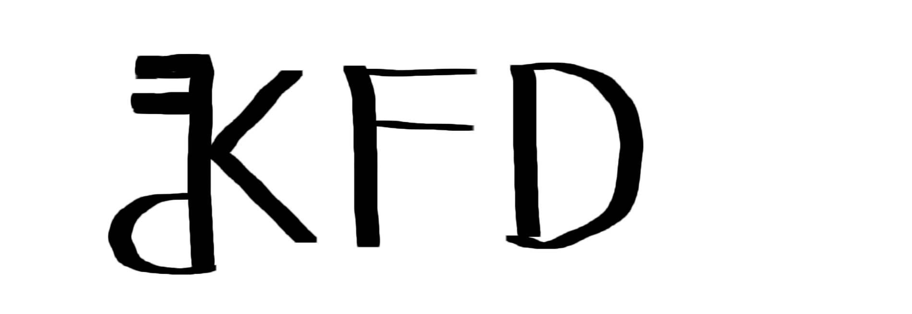

<p align="center">
  
</p>


[](https://github.com/giovanni-iannaccone/kfd/issues)


[](https://github.com/giovanni-iannaccone/kfd/stargazers)


# 🗝️ kfd (Keys For Developers)

**kfd** is a lightweight command-line tool for generating various types of random strings. It is designed to assist developers who need secure and unique keys, tokens, or identifiers for their applications but refuse to go on internet to get them.

## 🐧 Features
- Generate JWT keys
- Generate version 4 UUIDs
- Create random alphanumeric strings
- Generate random letter-only strings
- Create random hexadecimal strings
- Generate random numbers

## 🛸 Installation 
1. Download kfd with git
```sh
git clone https://github.com/giovanni-iannaccone/kfd
cd kfd
```

2. Compile it using make
```sh
make all
```

## 🎮 Usage
```
kfd v 1.0.0
-h | --help         show this message

-j  | --jwt         generate a jwt key
-u  | --uuid        generate version 4 uuid

-a {len} | --alphanum {len}     get a random string of len length
-c {len} | --char {len}         get a random letters-only string of len length
-x {len} | --hex {len}          get a random hex of len length
-n {len} | --number {len}       get a random number of len length
```

### Parameters:

- `-j` | `--jwt` <br/>
Generates a jwt key (an alphanumeric string with length 64)

- `-u` | `--uuid` <br/>
Generates an uuid ( an hexadecimal string divided into 8-4-4-4-12)

- `-a` | `--alpha` <br/>
This option generates a random alphanumeric string of a specified length

- `-c` | `--char` <br/>
Get a random letters-only string of a specified length 

- `-x` | `--hex` <br/>
Get a random hex string of specified length

- `-n` | `--number` <br/>
Generates a number with a specified number of digits.

## 🧩 Contributing
We welcome contributions! Please follow these steps:

1. Fork the repository.
2. Create a new branch ( using <a href="https://medium.com/@abhay.pixolo/naming-conventions-for-git-branches-a-cheatsheet-8549feca2534">this</a> convention).
3. Make your changes and commit them with descriptive messages.
4. Push your changes to your fork.
5. Create a pull request to the main repository.

## ⚖️ License
This project is licensed under the GPL-3.0 License. See the LICENSE file for details.

## ⚔️ Contact
- For any inquiries or support, please contact <a href="mailto:iannacconegiovanni444@gmail.com"> iannacconegiovanni444@gmail.com </a>.
- Visit my site for more informations about me and my work <a href="https://giovanni-iannaccone.github.io" target=”_blank” rel="noopener noreferrer"> https://giovanni-iannaccone.github.io </a>
